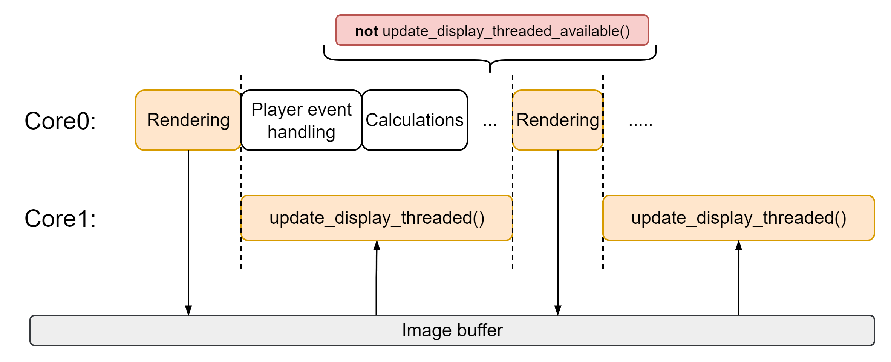
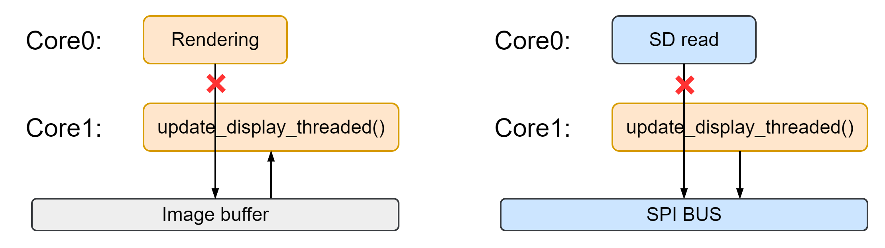

#####################
Display
#####################

.. contents::
    :local:
    :depth: 2

Canvas
-----------------

The ``gamepad.canvas`` instance is the main drawing surface used to render graphics for the display. It represents an image buffer on which any :ref:`graphics functions <graphics_section>` can be composed before showing on the display.

Canvas can be cleared (filled black) using :cpp:func:`Gamepad::clear_canvas`.

It is implied to fully render frame on canvas and then :ref:`update the display <disp_update_section>`.

Since ``gamepad.canvas`` is is a pointer, its functions must be accessed via ``->``.

.. code-block:: cpp

    gamepad.clear_canvas();
    gamepad.canvas -> fillRect(0, 0, 100, 100, TFT_RED);
    gamepad.canvas -> setCursor(0, 0);

.. _disp_update_section:

Display Update
-----------------

Call :cpp:func:`Gamepad::update_display` for update. It is a procedure of transfering ``gamepad.canvas`` image buffer to the display. Only after that player would see the rendered image.

Since image buffer stores large amount of data, it **takes a while** to transfer it to the display.

.. note::
    It takes about ``23.7 ms`` to update display.

.. note::
    Frequent updates can cause :ref:`flickering <flickering_section>`.

Threaded Update
-----------------

Updates can cause lags if the calculations beteween updates take considering amount of time. In this case further optimization is needed.

The :cpp:func:`Gamepad::update_display_threaded` optimizes display update by performing transfer in the second core. This method is preferable in fps-sensetive appliacations. While being more optimized the method requires more from the user.

The typical aplication **timeline diagram** is presented below.

   Common threaded update execution timeline

.. note::
    Frequent updates can cause :ref:`flickering <flickering_section>`.

Availability
^^^^^^^^^^^^^^^^^^

.. warning::
    It is not possible to update ``gamepad.canvas`` or use ``gamepad.game_files`` during threaded update due to image buffer memory region and SPI bus are busy. Interaction with them may cause **core fatal error**.

   Unallowed parallel operations

To check if the parallel update is not running use :cpp:func:`update_display_threaded_available`. If the frame is ready but threaded update is busy, code **must wait** until it would be available.

Common examples
^^^^^^^^^^^^^^^^^^

.. code-block:: cpp

    /*
    * In this example fps would hold at around 40 FPS before calc_time reaches
    * 23ms (display update time), after that it will drop with the higher
    * "calculation" time. 
    */
    
    uint16_t calc_time = 1;
    uint64_t last_update = 0;

    void loop() {
        // delay will pretend lots of calculatons
        // calc_time changes over time to show the parallelization effect
        delay(calc_time / 10);
        if(++calc_time > 500)
            calc_time = 1;

        // wait until previous update finishes
        while(!gamepad.update_display_threaded_available());

        gamepad.clear_canvas();
        gamepad.canvas -> fillRect(millis() / 10 % 320, 100, 10, 10, TFT_RED);  // running rectangle
        gamepad.canvas -> setCursor(0, 0);
        float fps = 1000.0 / (millis() - last_update);
        // print current fps and calc_time (time program spent on calculations)
        gamepad.canvas -> printf("fps: %f      calc_time: %d", fps, calc_time / 10);
        
        // start threaded update
        last_update = millis();
        gamepad.update_display_threaded();
    }

.. _graphics_section:

Graphics
-----------------
.. toctree::
   :maxdepth: 2

   graphics/eSPI.rst
   graphics/fonts.rst
   graphics/images.rst

Layers
-----------------

.. _flickering_section:

Flickering
-----------------

API reference
-----------------

.. doxygenfunction:: Gamepad::clear_canvas
.. doxygenfunction:: Gamepad::update_display
.. doxygenfunction:: Gamepad::update_display_threaded
.. doxygenfunction:: Gamepad::update_display_threaded_available